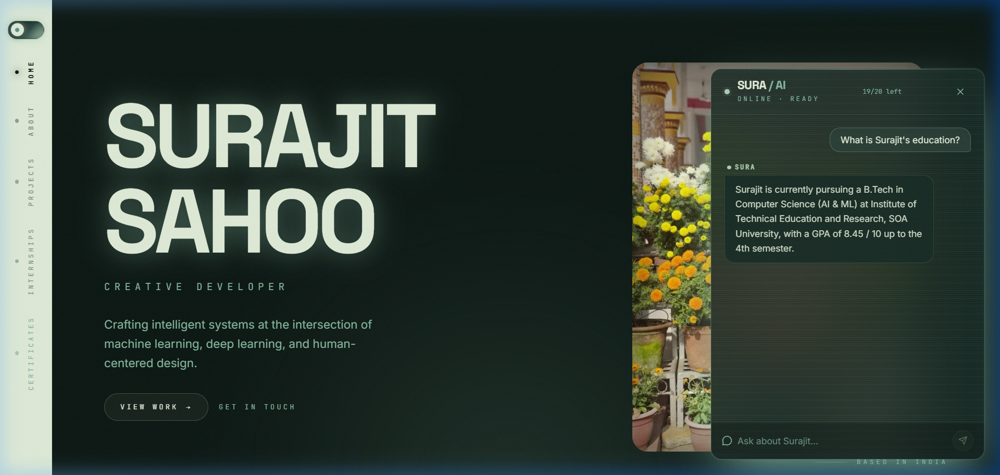

# Surajit Sahoo — Personal Portfolio

A glassmorphic personal portfolio website built with React, TypeScript, and Vite. Features an integrated AI chatbot (SURA) powered by Groq.

## 📸 Screenshots

### Hero & About


### Projects


### SURA AI Chatbot


---

## 🛠️ Local Setup

```bash
npm install
```

Create a `.env` file in the root:
```env
GROQ_API_KEY=your_groq_api_key_here
```

Run locally:
```bash
npm run dev
```

Open **[http://localhost:8080](http://localhost:8080)**

---

## 📁 Structure

```
├── src/               # New website source code
├── public/            # Static assets, resume, screenshots
└── Old website/       # Archived previous website
```
